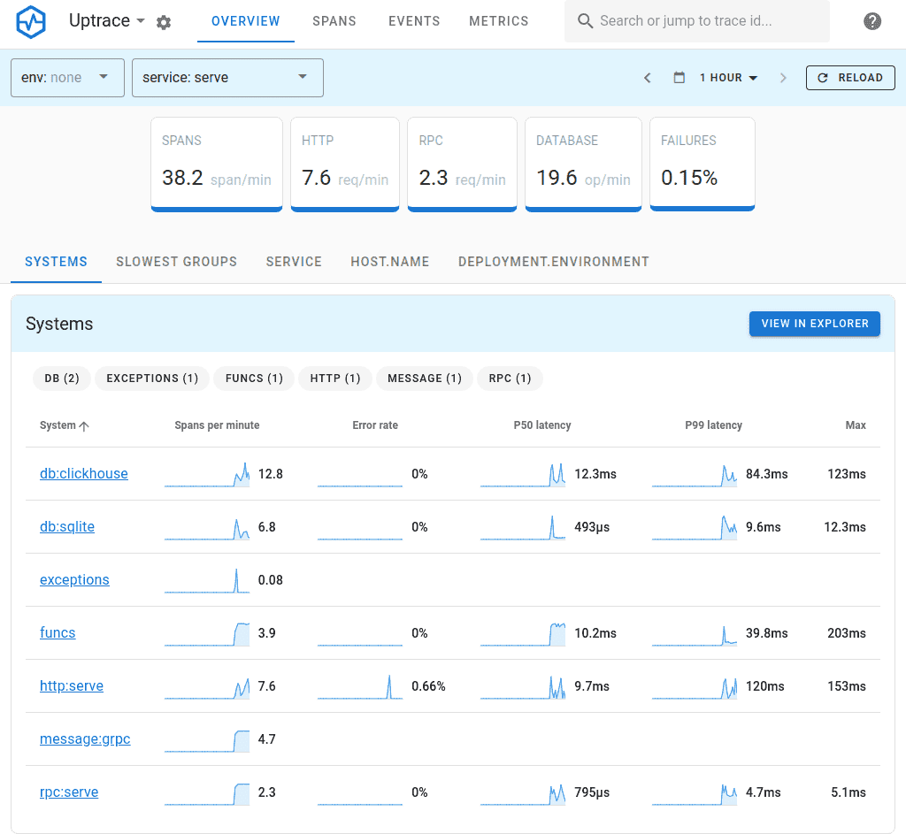
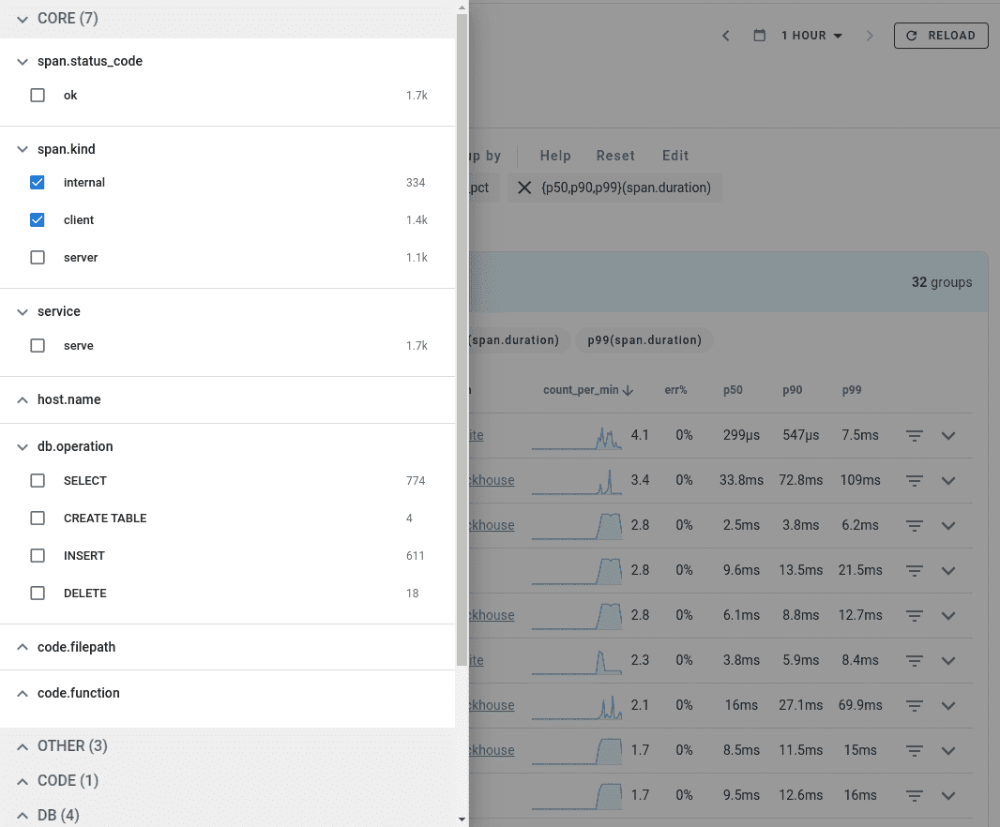
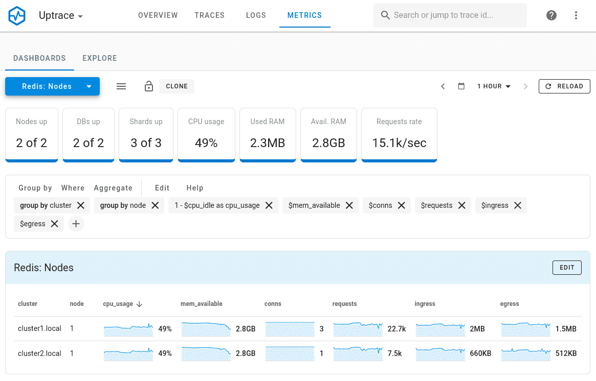
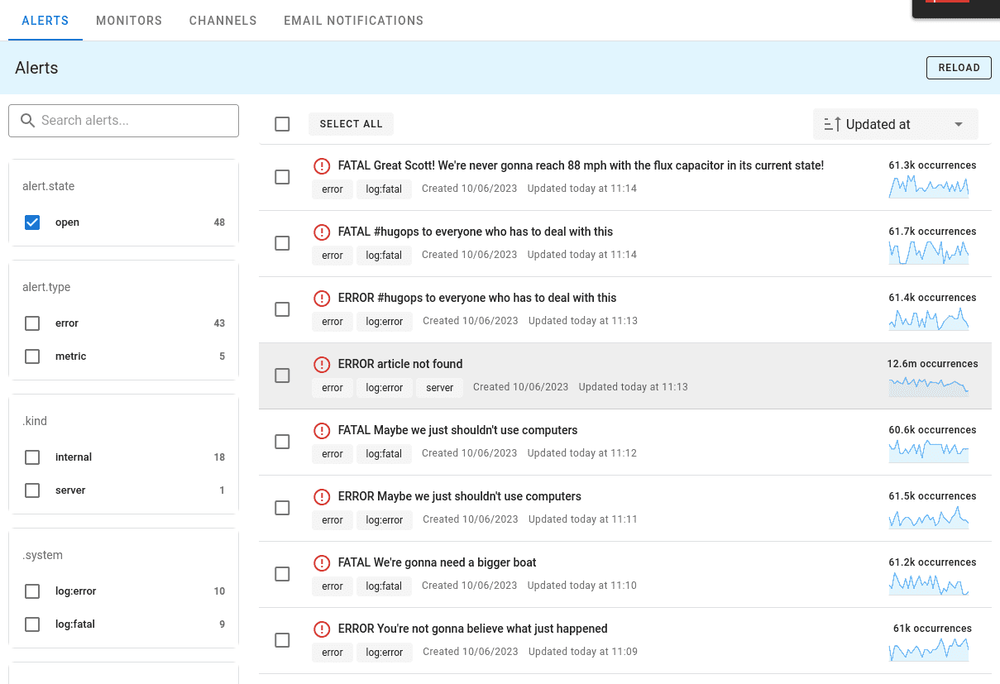

Languages: **English** | [简体中文](README.zh.md)

# Open source APM: OpenTelemetry traces, metrics, and logs

Uptrace is an [open source APM](https://uptrace.dev/get/open-source-apm.html) that supports
distributed tracing, metrics, and logs. You can use it to monitor applications and set up automatic
alerts to receive notifications via email, Slack, Telegram, and more.

Uptrace uses OpenTelelemetry to collect data and ClickHouse database to store it. Uptrace also
requires PostgreSQL database to store metadata such as metric names and alerts.

**Features**:

- Single UI for traces, metrics, and logs.
- SQL-like query language to [aggregate spans](https://uptrace.dev/get/querying-spans.html).
- Promql-like language to [aggregate metrics](https://uptrace.dev/get/querying-metrics.html).
- Built-in [alerts](https://uptrace.dev/get/alerting.html) with notifications via Email, Slack,
  WebHook, and AlertManager.
- Pre-built metrics dashboards.
- Multiple users/projects via YAML config.
- Single sign-on (SSO) using OpenID Connect: [Keycloak](https://uptrace.dev/get/sso/keycloak.html),
  [Google Cloud](https://uptrace.dev/get/sso/google.html), and
  [Cloudflare](https://uptrace.dev/get/sso/cloudflare.html).
- Ingestion using [OpenTelemetry](https://uptrace.dev/get/ingest/opentelemetry.html),
  [Vector](https://uptrace.dev/get/ingest/vector.html),
  [FluentBit](https://uptrace.dev/get/ingest/fluent-bit.html),
  [CloudWatch](https://uptrace.dev/get/ingest/aws-cloudwatch.html), and more.
- Efficient processing: more than 10K spans / second on a single core.
- Excellent on-disk compression: 1KB span can be compressed down to ~40 bytes.

**System overview**

**Faceted filters**

**Metrics**

**Alerts**

## Quickstart

In just few minutes, you can try Uptrace by running a [docker-compose example](example/docker). You
can also play with the public [Uptrace Cloud demo](https://app.uptrace.dev/play) (no login
required).

Then follow the [getting started](https://uptrace.dev/get/get-started.html) guide.

## Help

Have questions? Get help via [Telegram](https://t.me/uptrace),
[Slack](https://join.slack.com/t/uptracedev/shared_invite/zt-1xr19nhom-cEE3QKSVt172JdQLXgXGvw), or
[start a discussion](https://github.com/uptrace/uptrace/discussions) on GitHub.

## FAQ

**What is the license?**

The Business Source [License](LICENSE) is identical to Apache 2.0 with the only exception being that
you can't use the code to create a cloud service or, in other words, resell the product to others.

BSL is adopted by MariaDB, Sentry, CockroachDB, Couchbase and many others. In most cases, it is a
more permissive license than, for example, AGPL or double licensing (MIT + ee), because it allows
you to make private changes to the code.

In three years, the code also becomes available under Apache 2.0 license. You can learn more about
BSL [here](https://mariadb.com/bsl-faq-adopting/).

**Can I use Uptrace to monitor commercial or production-grade applications?**

Yes, you can use Uptrace to monitor **your** applications and provide employees access to the
Uptrace app without any limitations.

**Why BSL license**?

The Uptrace team picked BSL license with the intention to allow users monitor their applications,
but to forbid other companies creating a [cloud service](https://uptrace.dev/cloud) using the code.

**Are you open-source?**

Technically, the BSL license is classified as source-available, but we continue to use the term
open-source on the basis that the source code is open.

Existing SEO practices don't leave us much choice and our competitors do more or less the same.

**Is the database schema stable?**

Yes, but we are still making changes to the database schema and plan to switch to
[ClickHouse dynamic subcolumns](https://github.com/ClickHouse/ClickHouse/pull/23932) when that
feature is
[stable](https://github.com/ClickHouse/ClickHouse/issues?q=is%3Aissue+is%3Aopen+label%3Acomp-type-object)
enough.

## Contributing

See [Contributing to Uptrace](https://uptrace.dev/get/contributing.html).

